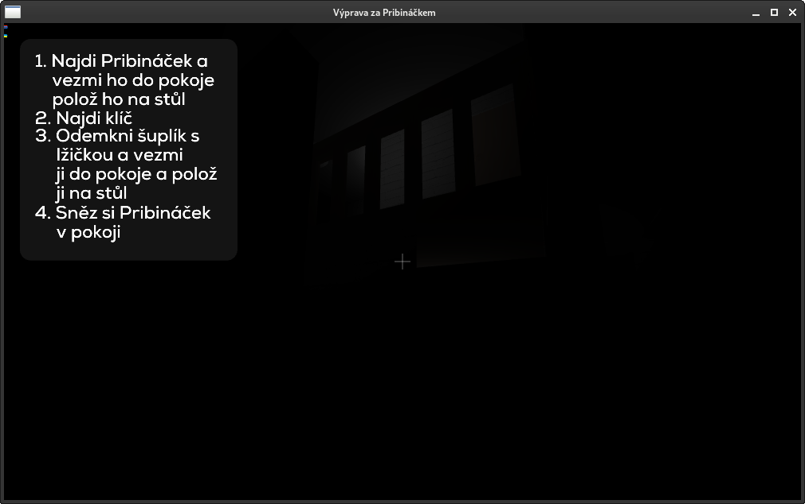

# Výprava za pribináčkem verze 1.4.0
Velice vtipná hra o cestě pro pribináčka

## Stažení
- [Itch.io](https://penk-studios.itch.io/vyprava-za-pribinackem-lite)
- [Google Play](https://play.google.com/store/apps/details?id=com.zahon.pribinacek)

## Přídáno
- Šipka zpátky
- Vylepšen úhel u nové hry
- Základní server a text-klient pro pribináčka (externí) 
- Základní multiplayer (pořád hodně WIP)
- Přidana sekce: bugy

## Bugy
1. Možný buffer overflow (nejspíše) u multiplayeru

   
   
   
   

   Popis: Normální setup s běžícím serverem, hráč hostne hru, druhý se připojí  
   Detaily: Zabugovaný klient byl ten, co se připojil. Kamera vypadá, jakoby byla "offsetnutá" od pozice hráče (kolize fungují jako kdyby byl hráč na pozici podle pozorovatele, stejně jako podle obrázku na tom je i "baterka" hráče). Funguje i po opuštění hry.

2. Scaling potíže s safem (tlačítka)

3. Mobil lze brát přes safe

## Potřeby
- [raylib](https://github.com/raysan5/raylib)
- [mingw-std-thread](https://github.com/meganz/mingw-std-threads) (pouze na windows)

-------------
## Buildování
### Linux
`# make linux`

### Windows
`# make windows`